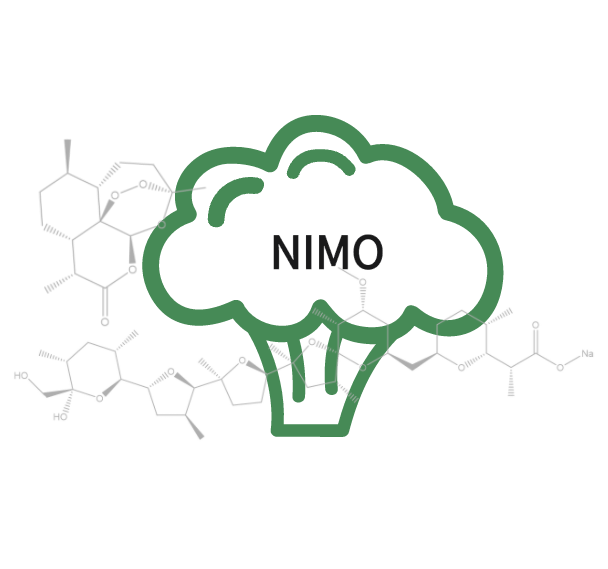

# Nimo


This is the code for the "Nimo: a Nature Inspired Molecular Generative Model Based on Fragments of Natural Products" paper.

The models was based on [OpenNMT-py 2.0](http://opennmt.net/OpenNMT-py/).

## Environment
- python = 3.6.13
- pytroch = 1.8.1
- RDKit
- numpy
- pandas

## Notes
- Nimom is a generic model for de novo generation.
Nimos is a scaffold-based model for lead optimization by specifying an extra scaffold. They are distinguished by two different motif extraction methods.


- The default task of our code is multi-constraint molecular generation. 
The Wildman–Crippen partition coefficient (logP), drug-likeness (QED) and synthetic accessibility score (SAS) are selected as constraints to train model. 


- Users can customize their own tasks by modifying the code or providing own data.


## Pre-processing 

The pre-processed datasets can be found on the `data/` folder. For raw input file, run: `preprocess.py`
 such as:

```bash
python .\preprocess.py --raw-data data\test\raw.csv --save-path data\test --specific_fragment Nimom
```

**Notes**:
- `-specific_fragment` is required here to specify motif extraction methods. `"Nimom"` or `"Nimos"` is optional.


## building vocabulary

From this configuration, we can build the vocabulary before training the model by run:`build_vocab.py`. such as:
```bash
python build_vocab.py -train_data data/test/dataset.smi -src_vocab data/test/run/test.vocab.src --n_sample -1
```


## Training

Model training can be started by running the `training.py` script. such as:
```bash
python train.py -train_data data/test/train.smi -valid_data data/test/valid.smi -src_vocab data/test/run/test.vocab.src -save_model data/test/run/models/model_lm -tensorboard_log_dir data/test/run/tensorboard
```


## Sampling 

Model sampling use the `generation.py` script. such as:
```bash
python generation.py -model data/coconut_M/run/models/model_lm_06_12_09_06_epoch_50000.pt -src data/coconut_M/lm_input.txt -output data/coconut_M/lm_pred.txt -n_best 5 -beam_size 10
```
Users can define a core scaffold for derivatives. Here, cite examples from scaffold-based scenario in the paper:

```bash
 1 python generation.py -model data/TeroKIT/run/models/model_lm_10_10_19_30_epoch_55000.pt -src data/TeroKIT/lm_input_scaffold1.txt -output data/TeroKIT/lm_scaffold1.txt -n_best 100 -beam_size 200 -scaffold 'C=C1CC[C@H]2C([*])([*])CCCC2([*])C1[*]'
```
```bash
 2 python generation.py -model data/TeroKIT/run/models/model_lm_10_10_19_30_epoch_55000.pt -src data/TeroKIT/lm_input_scaffold2.txt -output data/TeroKIT/lm_scaffold2.txt -n_best 100 -beam_size 200 --scaffold 'C1CC2([*])[C@@H](CCC3([*])[C@@H]2CC[C@@H]2[C@H]4C([*])CCC4([*])CCC23[*])C([*])([*])C1[*]'
```


